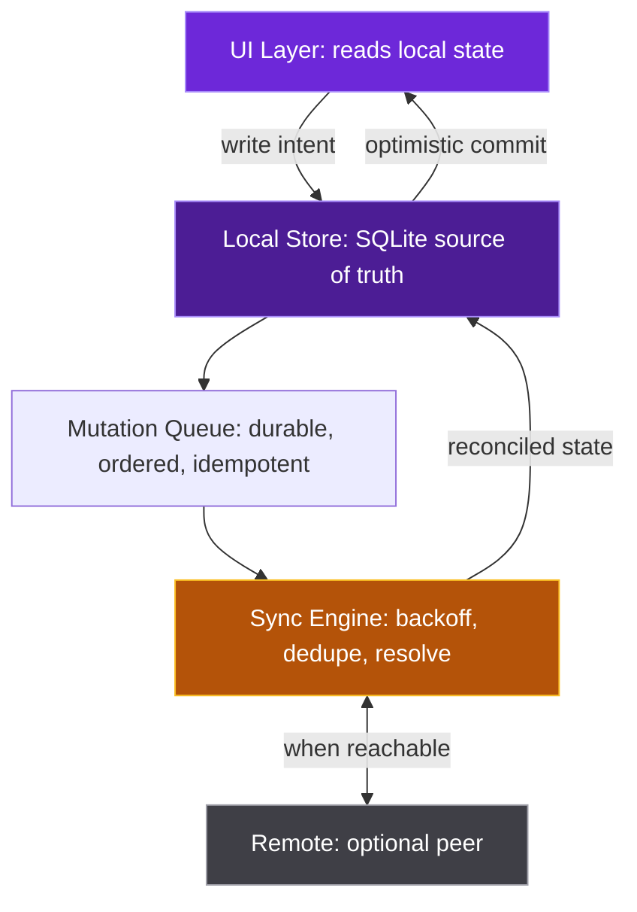

<a name="top"></a>

<div align="center">

<a href="https://github.com/spencerscott">
  
</a>

<br/>

<a href="https://github.com/spencerscott"></a>
<a href="https://github.com/spencerscott?tab=followers"></a>
<a href="https://github.com/spencerscott?tab=repositories"></a>
<a href="mailto:you@example.com"></a>

<br/><br/>

**[About](#about) | [Principles](#principles) | [Stack](#stack) | [Architecture](#architecture) | [Work](#work) | [Performance](#performance) | [Analytics](#analytics) | [Contact](#contact)**

</div>

---

## About

I build software across the full stack: **React** and **TypeScript** on the front end, **Flutter** for mobile, **Java** and **Python** for backend services, and **SQL** underneath it all.

My focus is on-device intelligence: pushing machine learning to the edge so applications respond instantly, work without connectivity, and keep user data on the device. No round-trips. No privacy tradeoffs. No excuses about signal.

```yaml
identity:
  name: Spencer Scott
  role: Full-Stack and Mobile Developer
  focus:
    - Flutter
    - On-Device AI
    - Offline-First Architecture
  building: Ingredient-to-Recipe
  principle: Ship fast. Respect privacy. Sweat the details.
```

<table>
<tr>
<td width="50%" valign="top">

**What I reach for first**

Flutter for anything with a screen and a user. One codebase, native feel on both platforms, and a render pipeline predictable enough to hit a frame budget on purpose.

</td>
<td width="50%" valign="top">

**What I avoid**

Server calls in the hot path. Client state that only makes sense when a request succeeds. Any architecture where "you must be online" is part of the user experience.

</td>
</tr>
</table>

---

## Principles

> **Great applications are not just built. They are felt.**
> Every interaction should be instant, every screen should feel alive, and every byte should respect the person holding the device.

| Principle | In practice |
|:--|:--|
| **Mobile-first** | One codebase with a native feel on every platform. |
| **On-device AI** | Models run locally. Private by architecture, not by policy. |
| **Offline-first** | The network is an enhancement, never a dependency. |
| **Built to last** | Clean architecture over expedient hacks. |
| **Measured, not guessed** | Frame time, cold start, and bundle size tracked in CI. |
| **Boring where it counts** | Novel in the product, conservative in the plumbing. |

---

## Stack

<details open>
<summary><b>Languages</b></summary>
<br/>


</details>

<details open>
<summary><b>Frameworks and platforms</b></summary>
<br/>


</details>

<details>
<summary><b>AI, data, testing, and delivery</b></summary>
<br/>


</details>

---

## Architecture

Offline-first is not a cache. The local database is the source of truth, and the server is a peer that syncs when reachable.



---

## Work

### Ingredient-to-Recipe

An offline-first Flutter application that identifies ingredients from a single photo and generates recipe suggestions entirely on-device. No server, no account, no connection required.

| Metric | Target | Why it matters |
|:--|:--:|:--|
| Inference latency | `< 400 ms` | Recognition should feel like a camera shutter. |
| End-to-end result | `< 1 s` | Photo to ranked recipes without a loading state. |
| Network calls | `0` | No telemetry, latency variance, or request cost. |
| Model footprint | `~12 MB` | The whole inference pipeline fits in the app bundle. |

**What was hard:** the first model was 94 MB and took 2.3 seconds on a mid-range Android device. Getting to 12 MB and 380 ms cost four points of top-1 accuracy, but recipe ranking tolerates a wrong guess better than a two-second wait. Pick the metric the user actually feels.

| Project | Description | Stack |
|:--|:--|:--|
| **Sync Engine** | Durable mutation queue with retries, backoff, ordering, and conflict policies. | Dart, SQLite, Drift |
| **Frame Budget CI** | GitHub Action that fails builds when p99 frame time regresses. | Dart, Actions, Python |
| **Model Shrink Toolkit** | Distillation, pruning, and INT8 export with accuracy reporting. | Python, PyTorch, ONNX |

---

## Performance

| Budget | Threshold | Enforced by |
|:--|:--:|:--|
| Cold start, p95 | `< 1.8 s` | Physical-device integration test |
| Frame build time, p99 | `< 16 ms` | Timeline parser |
| Jank frames per session | `< 0.5%` | Device test harness |
| Release bundle size | `< 40 MB` | Size diff on every pull request |
| Peak memory during inference | `< 220 MB` | Profiled device test |

---

## Analytics

The previous analytics section showed broken images because it depended on generated files that had not been published yet. This version uses live, cached Shields endpoints, so the section is useful immediately and does not render empty boxes.

<div align="center">

### Profile snapshot

<a href="https://github.com/spencerscott?tab=overview"></a>
<a href="https://github.com/spencerscott?tab=repositories"></a>
<a href="https://github.com/spencerscott?tab=stars"></a>
<a href="https://github.com/spencerscott"></a>

</div>

### Repository health

| Repository | Activity | Last commit | Language | Size |
|:--|:--|:--|:--|:--|
| [Ingredient-to-Recipe](https://github.com/spencerscott/ingredient-to-recipe) |  |  |  |  |
| [Sync Engine](https://github.com/spencerscott/sync-engine) |  |  |  |  |
| [Frame Budget CI](https://github.com/spencerscott/frame-budget-ci) |  |  |  |  |

### What the numbers mean

| Signal | Useful for | Limitation |
|:--|:--|:--|
| Followers and stars | Audience and project interest | Not a quality score. |
| Commit activity | Recent momentum | Squash merges compress many commits. |
| Top language | Repository identity | It does not show architecture or quality. |
| Last commit | Maintenance signal | A quiet project may simply be finished. |
| Repository size | Rough project scale | Assets and generated files can distort it. |

No fake green squares, no broken generated SVGs, no shared GitHub token pool. Just live links and numbers that render.

---

## Contact

Open to collaboration on mobile, on-device AI, and offline-first products. Best way in: a short note about what you are building and where it hurts.

<div align="center">

<a href="mailto:you@example.com"></a>
<a href="https://linkedin.com/in/yourhandle"></a>
<a href="https://yoursite.com"></a>
<a href="https://github.com/spencerscott?tab=repositories"></a>

<br/><br/>

**Thanks for stopping by.**

<br/>

*[Back to top](#top)*

</div>
