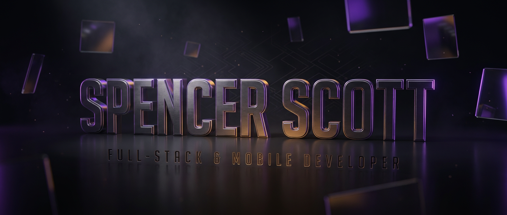

<a name="top"></a>

<div align="center">
  
</div>

<div align="center">

[](https://github.com/spencerscott)
[](https://github.com/spencerscott?tab=followers)
[](mailto:you@example.com)

**[About](#-about) · [Principles](#-engineering-principles) · [Stack](#-technical-stack) · [Focus](#-current-focus) · [Work](#-selected-work) · [Analytics](#-github-analytics) · [Contact](#-contact)**

</div>

---

## 🧭 About

I build software across the full stack: **React** and **TypeScript** on the front end, **Flutter** for mobile, **Java** and **Python** for backend services, **SQL** underneath it all.

My focus is on-device intelligence: pushing machine learning to the edge so applications respond instantly, function without connectivity, and never ship user data off the device. No round-trips. No privacy tradeoffs. No excuses about signal.

```yaml
identity:
  name:      "Spencer Scott"
  role:      "Full-Stack & Mobile Developer"
  focus:     ["Flutter", "On-Device AI", "Offline-First Architecture"]
  building:  "Ingredient-to-Recipe — AI recipe generation, fully offline"
  principle: "Ship fast. Respect privacy. Sweat the details."
```

---

## 🌠 Engineering Principles

> **Great applications aren't just built. They're felt.**
> Every interaction should be instant, every screen should feel alive, and every byte should respect the person holding the device.

| | Principle | In Practice |
|:--:|:--|:--|
| 📱 | **Mobile-First** | One codebase, native feel on every platform. Flutter done properly. |
| 🧠 | **On-Device AI** | Models that run locally. Private by architecture, not by policy. |
| ⚡ | **Offline-First** | The network is an enhancement, never a dependency. |
| 🏗️ | **Built to Last** | Clean architecture and maintainable systems over expedient hacks. |

---

## 🧰 Technical Stack

<details open>
<summary><b>💻 Languages</b></summary>
<br/>


</details>

<details open>
<summary><b>⚛️ Frameworks & Platforms</b></summary>
<br/>


</details>

<details>
<summary><b>🧠 AI & On-Device Intelligence</b></summary>
<br/>


</details>

<details>
<summary><b>🛠️ Tooling & Delivery</b></summary>
<br/>


<!-- More badges at https://shields.io -->

</details>

---

## 🔭 Current Focus

- **On-device machine learning** — quantized vision models running in real time on mid-range hardware
- **Offline-first Flutter** — conflict-free local persistence and sync that survives a dead connection
- **Performance engineering** — frame budgets, cold-start times, and memory profiles as first-class requirements

---

## 📸 Selected Work

### Ingredient-to-Recipe

An offline-first Flutter application that identifies ingredients from a single photo and generates recipe suggestions entirely on-device. No server, no account, no connection required.

| Step | What Happens |
|:--:|:--|
| 📷 | Capture a photo of the ingredients on hand |
| 🧠 | An on-device vision model identifies each item in frame |
| 🍽️ | Recipes are generated and ranked locally, in under a second |

**Stack** · `Flutter` `Dart` `TensorFlow Lite` `Computer Vision` `Offline-First`

> **Engineering note:** the full inference pipeline ships inside the app bundle. Zero network calls means zero telemetry, zero latency variance, and zero cost per request.

*Additional projects are available in the pinned repositories below ⤵️*

---

## 📊 GitHub Analytics

<div align="center">


<br/>


<br/>


<br/>


</div>

---

## 🌌 Contribution Graph

<!-- Requires the platane/snk GitHub Action configured to push to an `output` branch -->

<div align="center">
  
</div>

---

## 🤝 Contact

Open to collaboration on mobile, on-device AI, and offline-first products.

<div align="center">

[](mailto:you@example.com)
[](https://linkedin.com/in/yourhandle)
[](https://yoursite.com)

</div>

---

<div align="center">

**Thanks for stopping by.** ⭐

*[Back to top](#top)*

</div>
