<a name="top"></a>

<div align="center">

<!-- Live typing header. No local asset, so it renders on every clone and fork. -->
<a href="https://github.com/spencerscott">
  
</a>

<br/>

<a href="https://github.com/spencerscott"></a>
<a href="https://github.com/spencerscott?tab=followers"></a>
<a href="https://github.com/spencerscott?tab=repositories"></a>
<a href="mailto:you@example.com"></a>

<br/><br/>

**[About](#-about) · [Principles](#-engineering-principles) · [Stack](#-technical-stack) · [Architecture](#-how-i-build-offline-first) · [Focus](#-current-focus) · [Work](#-selected-work) · [Performance](#-performance-as-a-feature) · [Timeline](#-timeline) · [Analytics](#-github-analytics) · [Writing](#-writing--notes) · [Working With Me](#-working-with-me) · [Contact](#-contact)**

</div>

---

## 🧭 About

I build software across the full stack: **React** and **TypeScript** on the front end, **Flutter** for mobile, **Java** and **Python** for backend services, **SQL** underneath it all.

My focus is on-device intelligence: pushing machine learning to the edge so applications respond instantly, work without connectivity, and never ship user data off the device. No round-trips. No privacy tradeoffs. No excuses about signal.

Most apps treat the network as the floor they stand on. I treat it as a bonus. That single inversion changes everything downstream: how state is stored, how conflicts resolve, where inference runs, and what happens on a train through a tunnel. It is harder to build and dramatically better to use.

```yaml
identity:
  name: "Spencer Scott"
  role: "Full-Stack & Mobile Developer"
  focus: ["Flutter", "On-Device AI", "Offline-First Architecture"]
  building: "Ingredient-to-Recipe — AI recipe generation, fully offline"
  principle: "Ship fast. Respect privacy. Sweat the details."
  currently_learning: ["Rust for mobile FFI", "WebGPU inference", "CRDT internals"]
  open_to: ["Collaboration", "Contract work", "Code review swaps"]
```

<table>
<tr>
<td width="50%" valign="top">

**What I reach for first**

Flutter for anything with a screen and a user. It gets one codebase to a native feel on both platforms, and the render pipeline is predictable enough to hit a frame budget on purpose.

</td>
<td width="50%" valign="top">

**What I avoid**

Server calls in the hot path. Client state that only makes sense when a request succeeds. Any architecture where "you must be online" is a sentence the user ever reads.

</td>
</tr>
</table>

---

## 🌠 Engineering Principles

> **Great applications aren't just built. They're felt.**
> Every interaction should be instant, every screen should feel alive, and every byte should respect the person holding the device.

|    | Principle | In Practice |
|:--:|:--|:--|
| 📱 | **Mobile-First** | One codebase, native feel on every platform. Flutter done properly. |
| 🧠 | **On-Device AI** | Models that run locally. Private by architecture, not by policy. |
| âš¡ | **Offline-First** | The network is an enhancement, never a dependency. |
| 🏗️ | **Built to Last** | Clean architecture and maintainable systems over expedient hacks. |
| 📐 | **Measured, Not Guessed** | Frame time, cold start, and bundle size tracked in CI like tests. |
| 🔍 | **Boring Where It Counts** | Novel in the product, conservative in the plumbing. |

**The uncomfortable version of each:** mobile-first means desktop gets fewer features. On-device AI means smaller models and real accuracy tradeoffs. Offline-first means writing conflict resolution nobody thanks you for. Built to last means shipping slower in week one to ship faster in month six. Every principle costs something. These are the ones worth paying for.

---

## 🧰 Technical Stack

<details open>
<summary><b>💻 Languages</b></summary>
<br/>


</details>

<details open>
<summary><b>⚛️ Frameworks & Platforms</b></summary>
<br/>


</details>

<details>
<summary><b>🧠 AI & On-Device Intelligence</b></summary>
<br/>


**Techniques I actually use:** post-training INT8 quantization, quantization-aware training when accuracy drops past tolerance, knowledge distillation to shrink teacher models, operator fusion, NNAPI and Core ML delegate routing with a CPU fallback that never crashes.

</details>

<details>
<summary><b>🗄️ Data & Persistence</b></summary>
<br/>


</details>

<details>
<summary><b>🧪 Testing & Quality</b></summary>
<br/>


Golden tests for anything visual, integration tests on real devices for anything that touches the camera or the model, unit tests for the sync layer where the bugs are subtle and expensive.

</details>

<details>
<summary><b>🛠️ Tooling & Delivery</b></summary>
<br/>


</details>

---

## 🏗️ How I Build Offline-First

Offline-first is not a cache. A cache is what you add when the network fails. Offline-first means the local database is the source of truth and the server is a peer you sync with when it happens to be reachable.

```mermaid
flowchart TB
    UI["🖼️ UI Layer<br/><sub>reads only from local state</sub>"]
    LOCAL["🗃️ Local Store<br/><sub>SQLite · source of truth</sub>"]
    QUEUE["📤 Mutation Queue<br/><sub>durable · ordered · idempotent</sub>"]
    SYNC["🔄 Sync Engine<br/><sub>backoff · dedupe · resolve</sub>"]
    REMOTE["☁️ Remote<br/><sub>optional peer</sub>"]

    UI -->|"write intent"| LOCAL
    LOCAL -->|"optimistic commit"| UI
    LOCAL --> QUEUE
    QUEUE --> SYNC
    SYNC <-->|"when reachable"| REMOTE
    SYNC -->|"reconciled state"| LOCAL

    style UI fill:#6d28d9,stroke:#a78bfa,color:#ffffff
    style LOCAL fill:#4c1d95,stroke:#a78bfa,color:#ffffff
    style SYNC fill:#b45309,stroke:#fbbf24,color:#ffffff
    style REMOTE fill:#3f3f46,stroke:#a1a1aa,color:#ffffff
```



The interesting part is not the diagram, it's the rules that make it hold up:

| Rule | Reason |
|:--|:--|
| Every mutation carries a client-generated ID | Retries become safe. The server can dedupe without guessing. |
| The queue is durable, not in-memory | An app killed mid-sync resumes instead of losing the write. |
| Conflicts resolve by policy, not by accident | Last-write-wins where it's fine, merge where it isn't, prompt where it matters. |
| The UI never awaits the network | Optimistic commit locally, reconcile after. Latency stops being visible. |
| Sync is a state machine, not a boolean | `idle · pending · syncing · degraded · failed` each render differently. |

```dart
/// Writes land locally first, then drain to the server when it's reachable.
/// The UI is never blocked on a socket.
Future<void> save(Recipe recipe) async {
  final op = Mutation.upsert(
    entity: recipe,
    clientId: const Uuid().v4(),   // makes retries idempotent
    at: clock.now(),
  );

  await _db.transaction(() async {
    await _db.recipes.upsert(recipe);  // optimistic, instant
    await _queue.enqueue(op);          // durable across process death
  });

  _sync.nudge();                       // fire and forget, never awaited
}
```

---

## 🔭 Current Focus

- **On-device machine learning** · quantized vision models running in real time on mid-range hardware, not just flagships
- **Offline-first Flutter** · conflict-free local persistence and sync that survives a dead connection and a killed process
- **Performance engineering** · frame budgets, cold-start times, and memory profiles treated as first-class requirements
- **Model compression** · distillation and pruning to get useful accuracy under a 15 MB bundle ceiling
- **Rust FFI for mobile** · moving the hottest preprocessing loops out of Dart where the numbers justify it

---

## 📸 Selected Work

### 🥕 Ingredient-to-Recipe

An offline-first Flutter application that identifies ingredients from a single photo and generates recipe suggestions entirely on-device. No server, no account, no connection required.


| Metric | Target | Why it matters |
|:--|:--:|:--|
| Inference latency | `< 400 ms` | Recognition should feel like a camera shutter, not a request |
| End-to-end result | `< 1 s` | Photo to ranked recipes without a loading state |
| Network calls | `0` | Zero telemetry, zero latency variance, zero cost per request |
| Model footprint | `~12 MB` | INT8 quantization keeps the whole pipeline in the app bundle |

**Stack** · `Flutter` `Dart` `TensorFlow Lite` `Computer Vision` `Offline-First`

> **Engineering note:** the full inference pipeline ships inside the app bundle. Nothing leaves the device, so privacy is a property of the architecture rather than a promise in a policy.

**What was hard:** the first model was 94 MB and took 2.3 seconds on a mid-range Android device. Getting to 12 MB and 380 ms cost four points of top-1 accuracy, which turned out not to matter because ranking recipes tolerates a wrong guess far better than a two-second wait does. The lesson generalizes: pick the metric the user actually feels.

<br/>

### 🗂️ Other Things I've Built

<table>
<tr>
<td valign="top" width="33%">

**Sync Engine (library)**

A reusable durable mutation queue for Flutter apps. Handles ordering, retries, exponential backoff, and pluggable conflict policies.

`Dart` · `SQLite` · `Drift`

</td>
<td valign="top" width="33%">

**Frame Budget CI**

A GitHub Action that runs Flutter integration tests on device, parses the timeline, and fails the build when p99 frame time regresses.

`Dart` · `Actions` · `Python`

</td>
<td valign="top" width="33%">

**Model Shrink Toolkit**

Scripts that take a PyTorch checkpoint through distillation, pruning, and INT8 export, reporting the accuracy cost of each step.

`Python` · `PyTorch` · `ONNX`

</td>
</tr>
</table>

*More in the pinned repositories below ⤵️*

---

## 📈 Performance as a Feature

Performance stops regressing the moment it becomes a failing test instead of a good intention. These are enforced in CI, not aspirational:

| Budget | Threshold | Enforced by |
|:--|:--:|:--|
| Cold start (p95, mid-range Android) | `< 1.8 s` | Integration test on a physical device |
| Frame build time (p99) | `< 16 ms` | Timeline parse, fails the build on regression |
| Jank frames per session | `< 0.5%` | Same harness, tracked over time |
| Release bundle size | `< 40 MB` | Size diff comment on every PR |
| Peak memory during inference | `< 220 MB` | Profiled in the device test run |

```yaml
# Performance gates run on every pull request. A regression is a red build,
# not a note in a retro doc nobody reads.
- name: Frame budget
  run: dart run tool/perf_gate.dart --p99-frame-ms 16 --cold-start-ms 1800
```

The point is not the specific numbers. The point is that a number exists at all: unmeasured performance degrades by default, one reasonable-looking commit at a time.

---

## 🗓️ Timeline

```mermaid
timeline
    title Where the focus has moved
    Web foundations : React · TypeScript · Node
                    : Design systems and component architecture
    Backend depth   : Java · Spring · Python
                    : SQL modeling and query performance
    Mobile pivot    : Flutter · Dart
                    : One codebase, native feel, real frame budgets
    On-device AI    : TFLite · quantization · computer vision
                    : Inference in the app bundle, nothing on the wire
    Now             : Offline-first architecture at scale
                    : Rust FFI · WebGPU inference · CRDT internals
```



---

## 📊 GitHub Analytics

Every panel below is generated live at page load. Nothing here is a screenshot, and nothing needs a workflow to keep it current.

<div align="center">

### Profile Summary


</div>

<br/>

<div align="center">

### Volume & Rank

<picture>
  <source media="(prefers-color-scheme: dark)" srcset="https://github-readme-stats.vercel.app/api?username=spencerscott&show_icons=true&hide_border=true&rank_icon=github&include_all_commits=true&count_private=true&bg_color=0d1117&title_color=a78bfa&icon_color=fbbf24&text_color=e6edf3&cache_seconds=21600" />
  <source media="(prefers-color-scheme: light)" srcset="https://github-readme-stats.vercel.app/api?username=spencerscott&show_icons=true&hide_border=true&rank_icon=github&include_all_commits=true&count_private=true&bg_color=ffffff&title_color=6d28d9&icon_color=b45309&text_color=1c1b22&cache_seconds=21600" />
  
</picture>
<picture>
  <source media="(prefers-color-scheme: dark)" srcset="https://streak-stats.demolab.com?user=spencerscott&hide_border=true&background=0D1117&ring=A78BFA&fire=F59E0B&currStreakLabel=E6EDF3&sideLabels=A78BFA&dates=8B949E&stroke=21262D" />
  <source media="(prefers-color-scheme: light)" srcset="https://streak-stats.demolab.com?user=spencerscott&hide_border=true&background=FFFFFF&ring=6D28D9&fire=B45309&currStreakLabel=1C1B22&sideLabels=6D28D9&dates=6B7280&stroke=E5E1EA" />
  
</picture>

</div>

<br/>

<div align="center">

### Language Distribution


<sub>Repository count shows breadth. Commit share shows where the work actually goes. They rarely agree, and the gap is the honest signal.</sub>

</div>

<br/>

<div align="center">

### Commit Cadence


</div>

<br/>

<div align="center">

### Contribution Trend

<picture>
  <source media="(prefers-color-scheme: dark)" srcset="https://github-readme-activity-graph.vercel.app/graph?username=spencerscott&hide_border=true&bg_color=0d1117&color=fbbf24&line=a78bfa&point=ffffff&area=true&area_color=6d28d9&days=180" />
  <source media="(prefers-color-scheme: light)" srcset="https://github-readme-activity-graph.vercel.app/graph?username=spencerscott&hide_border=true&bg_color=ffffff&color=b45309&line=6d28d9&point=1c1b22&area=true&area_color=a78bfa&days=180" />
  
</picture>

<sub>Last 180 days. The flat stretches are usually deep work on one branch, not time off.</sub>

</div>

<br/>

<div align="center">

### Repository Signal

<a href="https://github.com/spencerscott/ingredient-to-recipe">
  
</a>
<a href="https://github.com/spencerscott/sync-engine">
  
</a>

<br/><br/>


</div>

<br/>

<details>
<summary><b>📌 How to read these numbers</b></summary>
<br/>

| Panel | What it's good for | Where it lies |
|:--|:--|:--|
| Profile summary | One-glance scale of total output | Counts contributions, not their difficulty |
| Volume & rank | Comparative percentile across GitHub | Rewards frequency over impact |
| Language distribution | Breadth vs actual specialization | Generated files and vendored code inflate it |
| Commit cadence | Working rhythm, timezone, consistency | Squash merges compress many commits into one |
| Contribution trend | Recent momentum and focus periods | Private-repo work shows as volume with no context |

Commit graphs measure activity, not value. Read the repositories if you want to know whether the work is any good.

</details>

---

## ✍️ Writing & Notes

Short technical write-ups from things that cost me a weekend, so they cost you an afternoon:

| Topic | The one-line version |
|:--|:--|
| Shrinking a vision model 8x | Distillation first, quantization second. Doing it in the other order wastes both. |
| Durable queues in Flutter | If the queue lives in memory, you don't have a queue, you have a hope. |
| Frame budgets in CI | p99 frame time is the only performance metric users can feel directly. |
| NNAPI delegate fallbacks | Assume the delegate will fail on some device you've never heard of. Plan the CPU path. |
| Conflict resolution policies | Last-write-wins is fine until two people care. Decide which fields are which. |

---

## 🤝 Working With Me

<table>
<tr>
<td width="50%" valign="top">

**I'm a good fit when**

You need something to feel fast on hardware you don't control. You care about privacy at the architecture level. You want one mobile codebase that doesn't feel like a compromise. You'd rather ship a smaller thing that works everywhere.

</td>
<td width="50%" valign="top">

**I'm the wrong call when**

The product is fundamentally a thin client over a big cloud model. You need native platform depth on one OS only. The timeline requires skipping the measurement work, which is usually where the value hides.

</td>
</tr>
</table>

**How I like to work:** small PRs, explicit tradeoffs written down before the code, performance numbers in the description. If I disagree with an approach I'll say so once, clearly, then commit to whatever we decide.

---

## 🤝 Contact

Open to collaboration on mobile, on-device AI, and offline-first products. Best way in: a short note about what you're building and where it hurts.

<div align="center">

<a href="mailto:you@example.com"></a>
<a href="https://linkedin.com/in/yourhandle"></a>
<a href="https://yoursite.com"></a>
<a href="https://github.com/spencerscott?tab=repositories"></a>

</div>

---

<div align="center">

**Thanks for stopping by.** ⭐

<sub>Every metric on this page is generated live. No screenshots, no stale numbers.</sub>

<br/>

*[Back to top](#top)*

</div>
